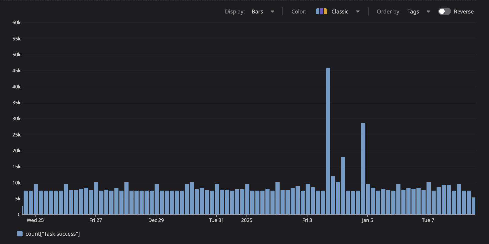

# Simplifying Task Queues with PostgreSQL

At [Gentrace](https://gentrace.ai), we help companies systematically test their generative AI systems. We launch evaluation tasks that use both LLM-as-judge and heuristic evaluation methods. Our task queue system processes thousands of evaluation tasks daily, powering critical features like our aggregate statistics computation. For example, when companies run large-scale evaluations (often thousands of test cases), we use asynchronous task queues to compute metrics like factual consistency and safety:


_Example of aggregate statistics computed asynchronously for test results_

Our task queue processes an average of 8,000-10,000 tasks per day, with spikes up to 45,000 tasks during peak periods when customers run large-scale evaluations:


_Task completion volume over a two-week period, demonstrating our system's ability to handle both steady-state and burst workloads_

While working on our evaluation infrastructure, we encountered an interesting architectural challenge: implementing our task queue strategy.

In our search for the right solution, we explored several options:

### Modern SaaS Solutions

First, we explored modern SaaS solutions like [Inngest](https://www.inngest.com/) and [Trigger.dev](https://trigger.dev/). These platforms offer impressive features - durable execution, retries, observability, and more out of the box. However, since many of our customers require self-hosted deployments for security and compliance reasons, we needed a solution we could package and distribute alongside our core product.

### Traditional Message Queues

The conventional approach then pointed us to battle-tested solutions like RabbitMQ and Redis - excellent tools that have proven their worth in production environments for years. But each additional infrastructure component would increase the operational burden for our self-hosted customers.

### Kafka: Leveraging Existing Infrastructure

We already had Kafka in our stack for ingesting observability data, so we naturally explored using it for task queues too. While Kafka's durability and throughput were appealing, modeling task maturity and retries within its append-only log model proved overly complex (as documented in [Uber's excellent write-up on reliable reprocessing](https://www.uber.com/blog/reliable-reprocessing/)).

Separate Kafka topics must be created for different processing intervals which makes it harder to have granular reprocessing times - this is an inherent limitation of topic processing. For example, if you want to retry a failed task after 5 minutes, 15 minutes, and 1 hour, you would need to create three separate topics and manage the message flow between them. This quickly becomes unwieldy as retry intervals become more granular or dynamic.

As we evaluated our options, we became increasingly worried about what we term "store explosion" - the gradual accumulation of different data stores in our stack. Each additional store introduces operational complexity, which is especially pernicious for our self-hosted customers who must manage these systems independently.

## The PostgreSQL Discovery

Our research led us to an elegant solution: PostgreSQL's `FOR UPDATE SKIP LOCKED` feature. This mechanism provides row-level locking during transactions while efficiently bypassing rows that are locked by other transactions - an ideal foundation for a distributed task queue. Since we already used PostgreSQL for our main database, this approach just worked™ without adding any extra moving parts to our system.

Our performance testing with expected concurrent workloads yielded compelling results. With a maximum backlog of a few thousand tasks at peak usage, the solution not only met our throughput requirements but significantly simplified our architecture.

> **Info:** We've open-sourced a simplified version of this implementation in our [simple-task-queue](https://github.com/gentrace/simple-task-queue) repository, which you can use as a starting point for your own projects.

We implemented a hybrid approach that combines the best of both worlds:

1. Tasks are inserted directly into the PostgreSQL `Task` table, allowing for larger payloads and complex metadata
2. A lightweight `NOTIFY` is triggered on a dedicated channel to signal task runners that new work is available
3. Task runners then query the `Task` table using `FOR UPDATE SKIP LOCKED` to claim and process work
4. Scheduled tasks can be registered with intervals for automatic execution

This approach helps us avoid:

- Message size limitations (since `NOTIFY` is only used as a signal)
- Complex replication slot management
- Potential issues with customer-provided database credentials

Our implementation consists of four main components:

### Task Queue

The core component that manages task storage and retrieval. It handles task insertion, claiming tasks for processing, and maintaining task state. Using PostgreSQL's `FOR UPDATE SKIP LOCKED`, it ensures tasks are processed exactly once while supporting parallel processing.

### Task Runner

A worker process that continuously claims and executes tasks. It handles retries, error reporting, and ensures graceful shutdown. Multiple runners can operate in parallel, with PostgreSQL handling the concurrency control.

### Task Scheduler

Manages scheduled and recurring tasks, handling timing, intervals, and task registration. It supports both one-time delayed tasks and recurring tasks with configurable intervals.

### Task Registry

Provides type-safe task registration and instantiation, managing task definitions and their execution intervals:

```typescript
export enum TASK_STATUS {
  SUCCESS = "SUCCESS",
  FAILURE = "FAILURE",
  IGNORED = "IGNORED",
}

export abstract class Task {
  tries = 0;
  type: string;
  createdAt: number;
  priority: number;

  protected constructor(type: string, priority = 100) {
    this.type = type;
    this.createdAt = Date.now();
    this.priority = priority;
  }

  abstract run(): Promise<TASK_STATUS>;
}

class TaskRegistry {
  private types = new Map<string, { new (): Task }>();
  private frequencies = new Map<string, number>();

  register<T extends Task>(
    typeStr: string,
    type: { new (): T },
    frequency?: number
  ) {
    this.types.set(typeStr, type);
    if (frequency) {
      this.frequencies.set(typeStr, frequency);
    }
  }

  build(typeStr: string) {
    const type = this.types.get(typeStr);
    return type ? new type() : null;
  }

  getTimedTasks() {
    return new Map(this.frequencies);
  }
}
```

Here's how we implemented this pattern:

```tsx
class TaskQueue {
  async getNextBatchToProcess(batchSize: number = 10) {
    return await prisma.$transaction(async (tx) => {
      const tasks = await tx.$queryRaw`
        DELETE FROM "Task" 
        WHERE id IN (
          SELECT id 
          FROM "Task" 
          WHERE "maturityAt" < NOW()
          ORDER BY priority DESC, "createdAt" ASC 
          LIMIT ${batchSize}
          FOR UPDATE SKIP LOCKED
        ) 
        RETURNING *;
      `;
      return tasks;
    });
  }

  async getTasksByType(type: string) {
    return await prisma.task.findMany({
      where: {
        payload: {
          path: ["type"],
          equals: type,
        },
      },
      orderBy: [{ priority: "desc" }, { createdAt: "asc" }],
    });
  }
}
```

For scheduled tasks like daily aggregate computations, we use a decorator pattern in TypeScript to register tasks with their execution intervals:

```tsx
@RegisterTask("DailyAggregate", 24 * 60 * 60 * 1000, { unique: true }) // Run once per day, ensure only one instance
class DailyAggregateTask extends Task {
  constructor() {
    super("DailyAggregate", 100); // type and priority
  }

  async run(): Promise<TASK_STATUS> {
    // Task implementation
  }
}
```

Our task scheduler maintains these intervals and handles graceful shutdowns:

```tsx
async function runTimer(taskName: string, frequency: number) {
  const enqueue = async () => {
    const task = taskRegistry.build(taskName);
    if (!task) {
      return;
    }
    await fireTask(task);
  };

  await enqueue(); // Initial run
  const interval = setInterval(() => {
    if (shuttingDown) {
      clearInterval(interval);
    } else {
      enqueue();
    }
  }, frequency);
}

// Initialize all scheduled tasks
async function main() {
  const frequencies = taskRegistry.getTimedTasks();
  for (const [taskName, frequency] of frequencies.entries()) {
    await runTimer(taskName, frequency);
  }
}
```

Tasks can also be fired with delayed execution or in batches with spacing:

```tsx
// Fire a task to run after 5 minutes
await fireTask(new ProcessEvaluationsTask(), 5 * 60 * 1000);

// Fire multiple tasks with 1-second spacing
await fireTasks([task1, task2, task3], {
  delaySpacingInMs: 1000,
});
```

## Results

The solution has proven highly effective in production, delivering several key benefits:

- Simpler infrastructure that's easier to maintain
- Built-in retries for failed tasks
- Fast parallel processing with row-level locking
- Easier setup for self-hosted users

Sometimes, PostgreSQL really is all you need.

## Warnings

While this solution has worked well for our use case, there are important considerations for high-throughput scenarios:

1. **Query Performance**:

   - The `FOR UPDATE SKIP LOCKED` operation becomes expensive at scale:
     - Lock table overhead grows with concurrent transactions
     - Each locked row requires memory in PostgreSQL's [lock table](https://www.postgresql.org/docs/current/explicit-locking.html#LOCKING-ROWS)
     - Sequential scanning becomes costly as workers must check each locked row ([source](https://www.postgresql.org/docs/current/indexes-types.html))
     - Later workers may need to scan through thousands of locked rows to find available tasks ([details](https://www.postgresql.org/docs/current/transaction-iso.html#XACT-ROW-LEVEL-LOCKING))
     - Can be mitigated with small batch sizes, proper indexing, and backoff strategies ([indexing guide](https://www.postgresql.org/docs/current/indexes-types.html))
   - Load test thoroughly if you expect more than 1000 tasks per second ([benchmarking guide](https://www.postgresql.org/docs/current/pgbench.html))
   - Ensure proper indexing on `maturityAt`, `priority`, and `createdAt` columns ([index creation](https://www.postgresql.org/docs/current/sql-createindex.html))

2. **Transaction Management**:

   - Keep task processing time minimal
   - Be mindful of your connection pool size
   - Long-running transactions can cause queue delays and deadlocks

3. **Polling Overhead**:
   - Our `NOTIFY`-based signaling reduces unnecessary polling
   - Task runners still need a fallback polling interval (we use 1 second)
   - For extremely high-throughput needs (10,000+ tasks/second), consider dedicated queue solutions like Redis or RabbitMQ

## Quickstart

Want to implement this task queue pattern in your own project? We have a TypeScript starter repository that you can use as a foundation: [simple-task-queue](https://github.com/gentrace/simple-task-queue).

This repository includes:

- Basic task queue implementation with PostgreSQL
- Type definitions and interfaces
- Example task implementations
- Setup instructions and best practices

Feel free to fork the repository and adapt it to your needs.

## Join Us

We're hiring senior and staff software engineers! We're looking for people who:

- Have deep TypeScript expertise and love distributed systems
- Build great developer tools and infrastructure
- Care about creating delightful developer experiences
- Want to help make AI safe and reliable

Check out our open positions <a href="https://gentrace.ai/eng">here</a>
